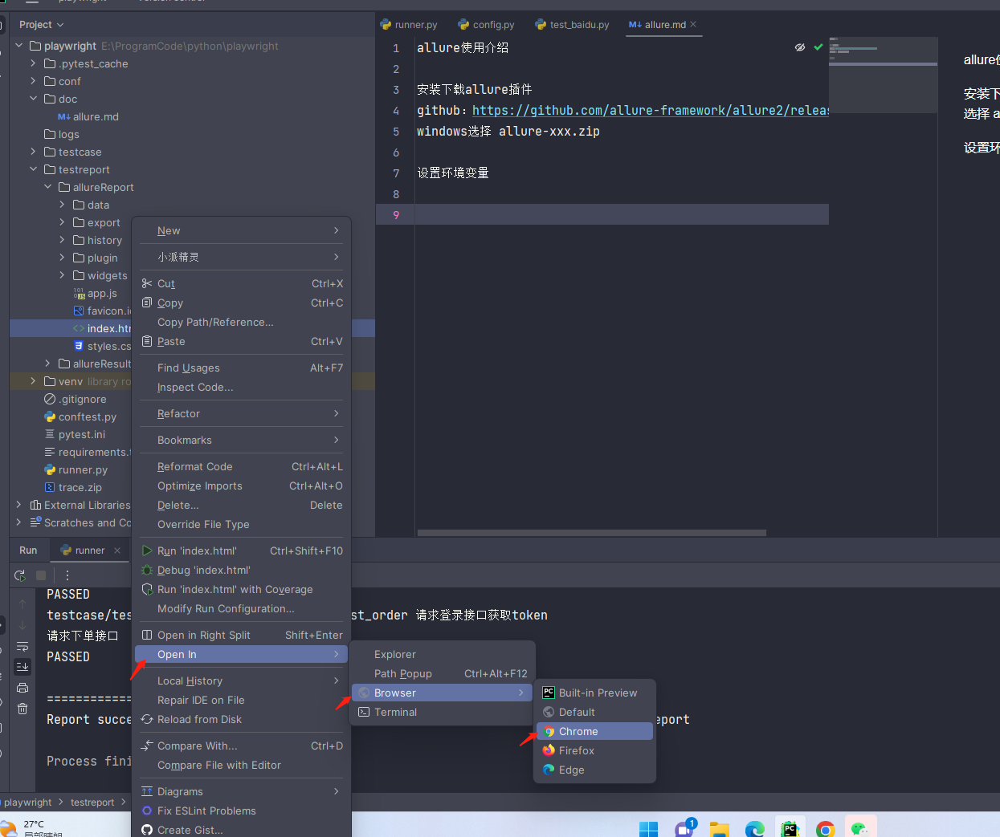
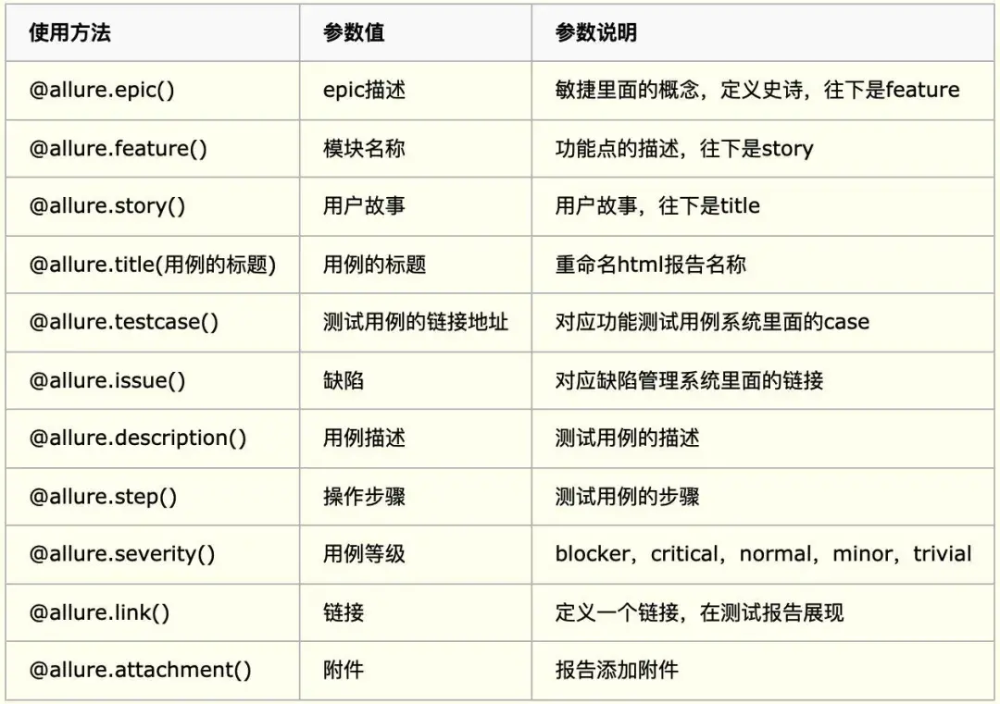
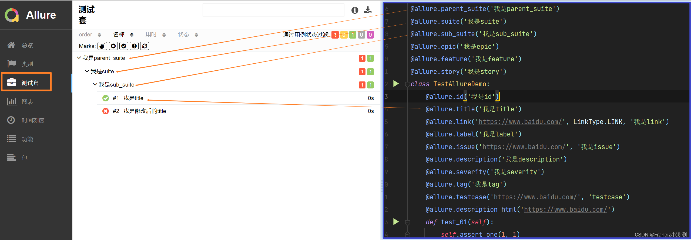
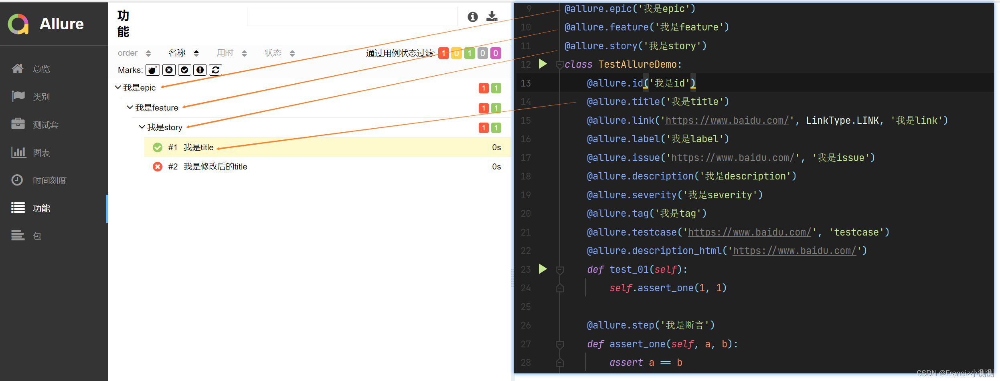
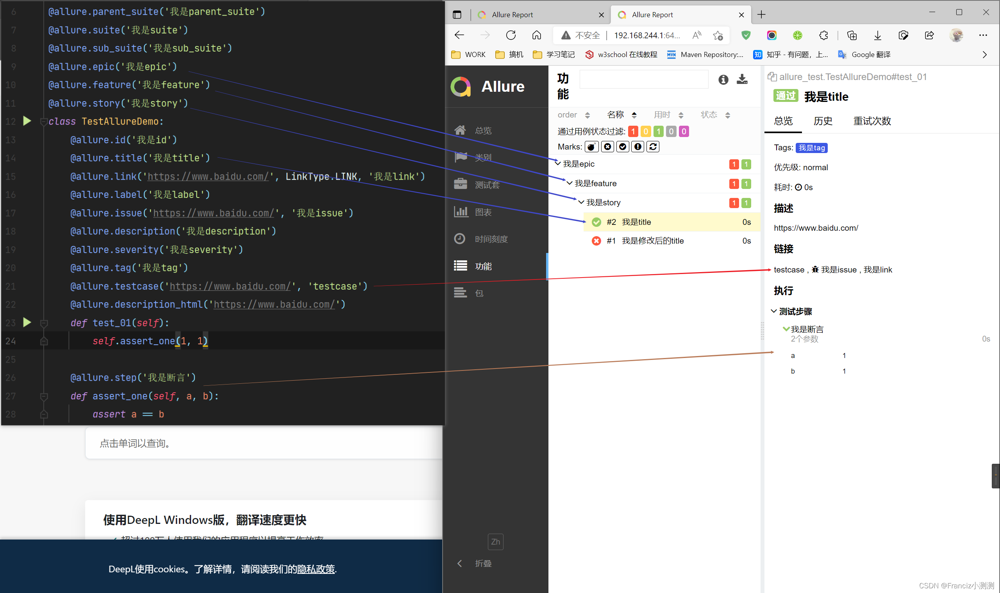
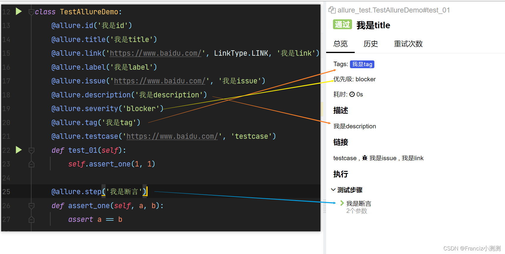
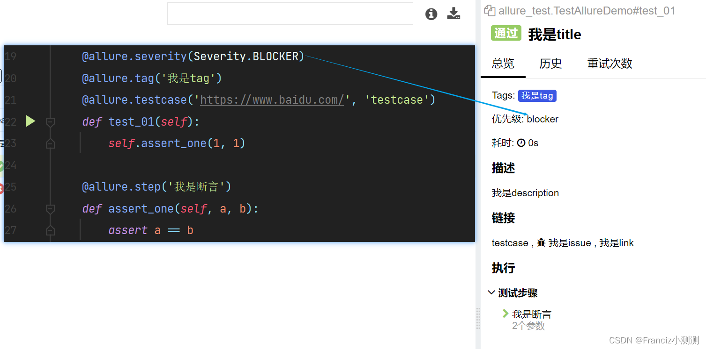
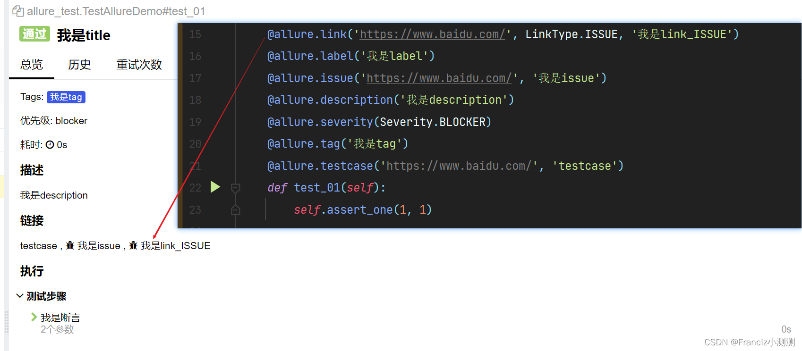

allure使用介绍

安装下载allure插件

github：https://github.com/allure-framework/allure2/releases

windows选择 allure-xxx.zip

设置环境变量：
allure-2.24.0\bin

文件中打开html报告

注意：allure报告的展示需要HTTP服务器的支持

使用pychram打开

使用allure自带的open命令打开
在终端执行命令：allure open ./report/allure_report，也可以打开报告指定ip和端口号

Allure注解释义/装饰器解释 

@allure.parent_suite,@allure.suite,@allure.sub_suite

@allure.epic, @allure.feature, @allure.story,@allure.title

@allure.id,@allure.link,@allure.label,@allure.issue,@allure.description,@allure.severity,@allure.tag,@allure.testcase,@allure.description_html

@allure.description_html不存在时

@allure.severity的参数说明
优先级的参数,也可以直接用后面的字符

    class Severity(str, Enum):
        BLOCKER = 'blocker'
        CRITICAL = 'critical'
        NORMAL = 'normal'
        MINOR = 'minor'
        TRIVIAL = 'trivial'

@allure.link的参数说明

    class LinkType(object):
        LINK = 'link'
        ISSUE = 'issue'
        TEST_CASE = 'test_case'
